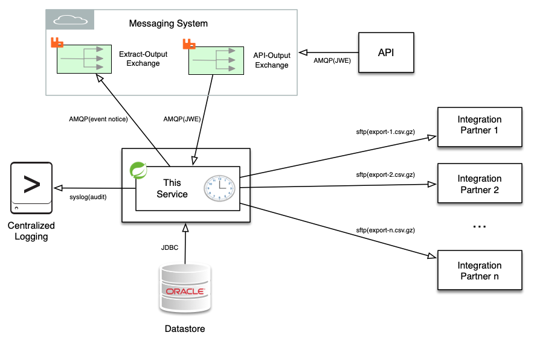

# Extract Publisher

  This Data Extract Job Scheduler application is a system service that will perform both scheduled and on-demand data 
  extracts from backend enterprise systems and then SFTP those extracts to remote internal or external integration 
  partners.  Data is compressed with gzip and then transferred over an encrypted channel to pre-defined remote systems 
  using either public key or passphrase authentication.  This service additionally listens to a [RabbitMQ](https://www.rabbitmq.com/) 
  AMQP exchange where the receipt of JSON Web Token ([JWT](https://en.wikipedia.org/wiki/JSON_Web_Token)) messages ([RS512](https://tools.ietf.org/html/rfc7518#section-3.3)
  signed and [AES256GCM](https://tools.ietf.org/html/rfc7518#section-4.7) encrypted) will trigger on-demand data extract jobs.  In the use case this was 
  designed for the remote integration partners have access to an API where they can POST data extract requests.  This 
  API in turn issues JWE messages over the AMQP event bus which are then serviced by this application.  This application
  is authored in Java using the [Spring Framework](https://spring.io/projects/spring-framework).
  

  
  On each job completion an AMQP event notice message will be sent to the Exchange you specify in the property 
  file.  In addition, email notifications on either/both success/failure may sent as specified in the application 
  property file. [Logback](https://logback.qos.ch/) is used to create a local application log file as well as log audit 
  events directly via Syslog to a remote central logging system.
  
  The [Bucket4j](https://github.com/vladimir-bukhtoyarov/bucket4j) implementation of the [token bucket algorithm](https://en.wikipedia.org/wiki/Token_bucket)
  is used to rate limit on-demand job execution so that an integration partner may not trigger export jobs at a rate
  that is faster or more frequent than you prefer. The [Nimbus JOSE + JWT](https://connect2id.com/products/nimbus-jose-jwt)
  implementation of JWT, JWS, and JWE was used to provide signed and encrypted JSON messaging.
   
  This application uses a distinct ssh known_hosts file per integration partner to prevent [MITM](https://en.wikipedia.org/wiki/Man-in-the-middle_attack)
  attacks on SFTP data transfer.  The known_hosts files used are specified in this application's property file.  Pinning 
  the integration partner host keys in this way will prevent against inadvertent communication with other hosts, but you
  will need to update the public host key in the known_host file for an integration partner if the remote host's 
  private key changes due to an intentional replacement or upgrade. 
   
  
  Using [Maven](https://maven.apache.org/) this application builds to one jar file, one property file, and one logging 
  configuration file.  In the property file you define attributes for each extract job.  Such as the remote host 
  you are SFTPing the extract to, the target path on that host, how you are authenticating, the location of your key 
  file, whether or not you would like email notifications, and what email addresses should receive these notifications.
    
  This application is built using the [Spring Cloud Stream](https://spring.io/projects/spring-cloud-stream) library 
  which combines [Spring Boot](https://spring.io/projects/spring-boot) and 
  [Spring Integration](https://spring.io/projects/spring-integration).  The Spring Integration library components are
  used to implement SFTP while the String Cloud Stream components are used for AQMP messaging input and output.  No 
  Spring XML configuration was used.  Spring Cloud Stream automatically builds Spring Integration flows bound to the 
  AMQP server specified in the property file.
   
  This is a Spring Boot service with support added in the Maven POM file for direct deployment over ssh to target 
  hosts/containers.  It also includes [jasypt](http://www.jasypt.org/features.html) support for strong encryption of
  property file values.  If you have credentials to encrypt for use with this application you can do so with 
  `components/StartUpTasks.java` by uncommenting a few lines.
  
  ## Requirements
  
  * To build you will need Java 11 or above and Maven.
  * To execute you will need Java 11 or above.
  
  ## Testing
  
  If you want to test locally you will need to receive and publish messages.  The below steps will launch a local 
  RabbitMQ Server Docker container to publish to, then compile the application, then start the application.  This 
  assumes you have Docker installed, and that both java and maven are on your path.
  
  * Change directory to the project root
  * `docker-compose up -d`
  
  * `./mvnw clean package -P localhost`
  
  * `/opt/extract-publisher/manual_start.sh`
  
  Now you may open the local RabbitMQ admin interface to monitor events. `http://localhost:15672` You should already see 
  that the exchanges you specified in the property file have been created.
  
  Init scripts are included to run this as a service but you just launched it interactively.  So from another shell you 
  can tail the log file where this applications output is directed.
  * `tail -f /opt/extract-publisher/extract-publisher.log`
  
  Once you are done testing `ctrl-c` will exit the application and `docker-compose down` will shutdown the RabbitMQ 
  container.
  
  ## Deploying
  
  Ssh deployment via [Maven Wagon](https://maven.apache.org/wagon/index.html) requires that you have created server 
  entries in your local `${user.home}/.m2/settings.xml` that specify authentication.  The ids of the these 
  `settings.xml`server definition stanzas should match the <ssh.deploy.profile> ids in this project's pom.xml file.
    
  The below will compile the application and file copy it to the path on the localhost specified in the profile with id 
  `localhost` specified in the pom.xml file.  The property file used will be the application.properties file in the 
  props/`localhost` directory.
  * `./mvnw clean install -P localhost`
  
  The below will compile the application and scp it to the host specified in the profile with id 
  `development` specified in the pom.xml file.  The property file used will be the application.properties file in the 
  props/`development` directory.
  * `./mvnw clean install -P development`
  
  The below will compile the application and scp it to the host specified in the profile with id 
  `production` specified in the pom.xml file.  The property file used will be the application.properties file in the 
  props/`production` directory.
  * `./mvnw clean install -P production`
  
  ## Linux init scripts
  
   Included are init scripts for two popular init systems so that this application may be run as a system service.  If 
    you use either script you should edit it to specify the path to your Java JRE.  Java does not need to be in the path 
    of the account that executes this application.
  
  ##### Adding System V init script:
  
  `sudo cp extract-publisher.systemV.init /etc/init.d/extract-publisher`
  
  `sudo chmod +x /etc/init.d/extract-publisher`
  
  `sudo chkconfig --add extract-publisher`
  
  ##### Adding systemd init script:
  
  `sudo cp extract-publisher.systemd.init /etc/systemd/system/extract-publisher.service`
  
  `sudo systemctl daemon-reload`
  
  `sudo systemctl enable extract-publisher`


---
## Appendix
### [Data transfer] How to create private key pairs for authorization to remote systems for use when SFTP'ing extract files
This generates two files. One is a public key you may disclose, and the other is a private key you must not disclose. 
The public key contents are copied into the ssh authorized_keys file on the remote host for the user this
application will be authenticating to.  The private key should be placed in this application's deployment 
directory as referenced in the property file so that it may be used. 
```
$ ssh-keygen -t rsa -b 4096 -m pem
Generating public/private rsa key pair.
Enter file in which to save the key (/Users/extract/.ssh/id_rsa): /opt/extract-publisher/auth/integration1_sftp_rsa
Enter passphrase (empty for no passphrase): 
Enter same passphrase again: 
Your identification has been saved in /opt/extract-publisher/auth/integration2_sftp_rsa.
Your public key has been saved in /opt/extract-publisher/auth/integration2_sftp_rsa.pub.
```
### [Messaging] How to create a pkcs12 keystore and add two key pairs to it
This is for use by the API which will sign JWT and send resulting JWS command messages over AMQP to this application

1. Create the first key pair and keystore file

    `$ keytool -genkeypair -alias api-rsa-signing-key -dname "CN=api.example.org, O=Example Org, C=US" -keyalg RSA -keysize 4096 -keystore api-keystore.pkcs12 -storetype PKCS12 -validity 7300 -storepass <passphrase>`

2. Add second key pair to keystore file

    `$ keytool -genkeypair -alias api-rsa-encryption-key -dname "CN=api.example.org, O=Example Org, C=US" -keyalg RSA -keysize 4096 -keystore api-keystore.pkcs12 -storetype PKCS12 -validity 7300 -storepass <passphrase>`

3. List the contents of the keystore file

    `$ keytool -list -v -keystore api-keystore.pkcs12`


### [Messaging] How to generate a public certificate from the API and add it to the keystore of this application
This application validates the RS512 signature of JWS command messages received via AMQP.  In order to register the
 API as an trusted signer the steps below may be used to generate a public certificate from the private key pair the API
 will use to sign messages.  This certificate is then added to the keystore used by this application so that it may
 be found by alias at runtime. This application's keystore (extract-publisher-keystore.pkcs12) should be placed in this
 application's deployment directory as referenced in the property file so that it may be used. 
    
1. Export a public certificate from the key pair in the API keystore that will be used to sign messages
    
    `$ keytool -export -keystore api-keystore.pkcs12 -alias api-rsa-signing-key -file api-rsa-signing-key.cert`
    
2. View the certificate
     
    `$ keytool -printcert -v -file api-rsa-signing-key.cert`
    
3. Add the certificate to the keystore file used by this application

    `$ keytool -import -alias api-rsa-signing-key -file api-rsa-signing-key.cert -keystore extract-publisher-keystore.pkcs12`
    
4. List the contents of keystore

    `$ keytool -list -v -keystore extract-publisher-keystore.pkcs12`

